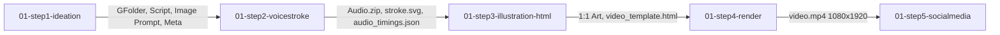

# 🎙️ 01-hanzidegushi-step2-voicestroke

> **Hệ thống Tự động hóa Bước 2: Sinh Hoạt Họa Nét Bút Hán Tự (Chinese Stroke) & Tổng Hợp Âm Thanh Phân Đoạn (Omni Voice & Edge-TTS) cho Series Hán Tự Đích Cố Sự (汉字的故事).**

---

## 🗺️ 1. Vị Trí Trong Toàn Bộ Pipeline 5 Bước



---

## 🛡️ 2. Hệ Thống 2 Chốt Chặn (Gatekeeper 2.A & 2.B)

| Gatekeeper | Tên Gọi | Vị Trí Hoạt Động | Tiêu Chuẩn Kiểm Duyệt | Hành Động Khi Lỗi |
| :--- | :--- | :--- | :--- | :--- |
| **GK-2.A** | **Stroke Animation Validator** | Luồng Flow 1 (Stroke Engine) | - Đủ số nét và đúng hình thái chữ.<br>- Thời lượng animation thích ứng theo số nét (1-3 nét: 3.5s; 4-5 nét: 5.5s; 6-8 nét: 8.5s; max 15s).<br>- Mỗi nét 1 màu sắc phân biệt $\rightarrow$ Đổi toàn bộ thành màu **Đỏ Bordeaux (`#800020`)** sau khi hoàn tất.<br>- Nền **trong suốt 100% (Alpha transparency)**. | **Làm lại nét:** Báo lỗi và không cho phép đồng bộ lên Drive. |
| **GK-2.B** | **Voice Completeness Validator** | Luồng Flow 2 (Voice Engine) | - Đầy đủ 8 tracks âm thanh (`vi_part1..4`, `zh_main`, `zh_1..2`, `vi_vidu`).<br>- Không bị mất âm, không rè, tốc độ đọc 130–160 WPM.<br>- `Audio.zip` và `audio_timings.json` đầy đủ mốc giây. | **Tái tạo âm thanh:** Báo lỗi và ghi âm/tổng hợp lại các track bị thiếu. |

---

## 📦 3. Sản Phẩm Đầu Ra Của Step 2

Sau khi GK-2.A và GK-2.B phê duyệt:
1. **`Audio.zip` ➔ Tải lên GFolder & ghi link vào Cột G (`Voice`)**: Chứa toàn bộ 8 file âm thanh chất lượng cao.
2. **`stroke.svg` ➔ Tải lên GFolder**: Hoạt họa nét bút đa sắc, chuyển màu đỏ bordeaux, nền trong suốt.
3. **`audio_timings.json` ➔ Tải lên GFolder**: Mốc giây chính xác từng track để Step 3 nhúng trực tiếp vào GSAP timeline.
4. **Cột D (`Status`)**: Chuyển trạng thái sang **`Voice`**.

---

## ⚙️ 4. Hướng Dẫn Thực Thi

### A. Chạy Kiểm Thử TDD Local:
```bash
PYTHONPATH=. python3 -m unittest discover -s tests -p "test_*.py" -v
```

### B. Chạy Xử Lý 1 Hàng Cụ Thể (ví dụ Hàng 226 - Chữ `门`):
```bash
python3 src/step2_runner.py --row 226
```

### C. Chạy Bằng GitHub Actions Workflow:
Vào tab **Actions** trên GitHub repo `lelehoctiengtrung/01-hanzidegushi-step2-voicestroke` ➔ Chọn **Step 2: Voice & Stroke Generation** ➔ Nhập số `row` (ví dụ `226`) ➔ Bấm **Run workflow**.

---

## 📂 5. Cấu Trúc Mã Nguồn (Tất Cả Các File $\le 150$ Dòng)

```text
├── .github/workflows/
│   └── voicestroke_hanzidegushi.yml  # GitHub Actions workflow với cache stroke & models
├── src/
│   ├── audio_packager.py             # Tính mốc giây audio_timings.json & nén Audio.zip
│   ├── gdrive_adapter.py             # Upload Audio.zip & Stroke assets lên GDrive
│   ├── gk_stroke_validator.py        # Gatekeeper 2.A (Kiểm tra nét, màu sắc, transparency)
│   ├── gk_voice_validator.py         # Gatekeeper 2.B (Kiểm tra 8 tracks, pacing, audio clarity)
│   ├── secret_manager.py             # Quản lý Secrets và cấu hình
│   ├── sheets_adapter.py             # Cập nhật Cột G (Voice) & Status -> 'Voice'
│   ├── step2_runner.py               # Entrypoint Runner với luồng chạy song song Flow 1 & Flow 2
│   ├── stroke_cache.py               # Quản lý cache dataset nét Hán tự
│   ├── stroke_engine.py              # Động cơ tạo hoạt họa nét bút & đổi màu đỏ bordeaux
│   └── voice_engine.py               # Động cơ tổng hợp giọng đọc tiếng Việt & tiếng Trung
├── tests/                            # Bộ kiểm thử TDD tự động cho Step 2
├── requirements.txt
└── README.md
```
